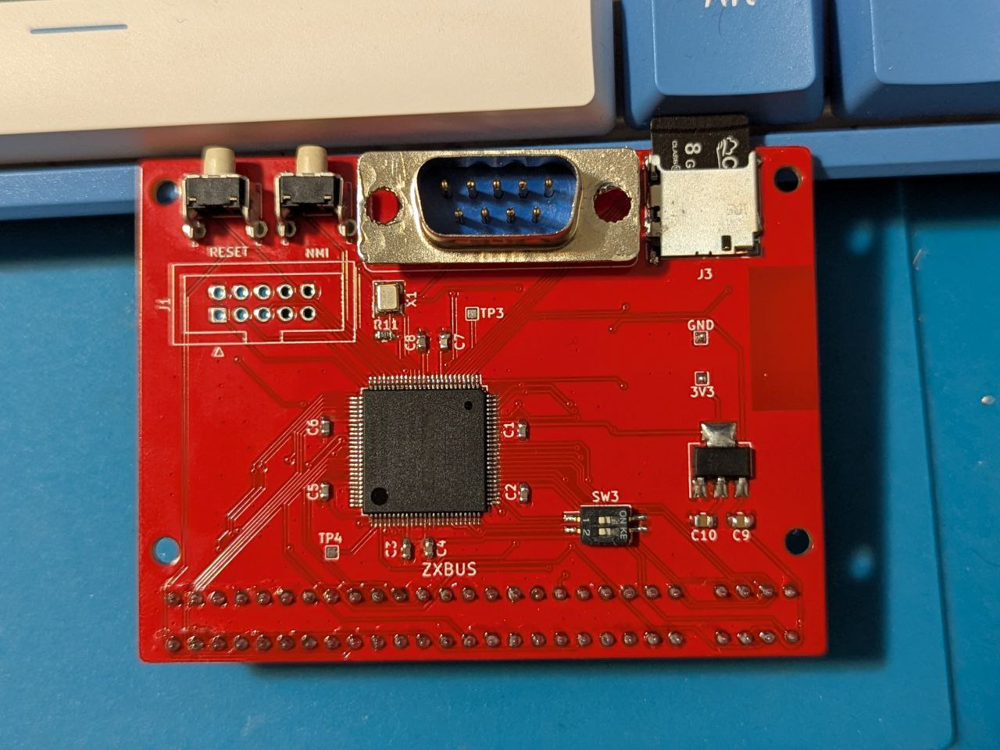
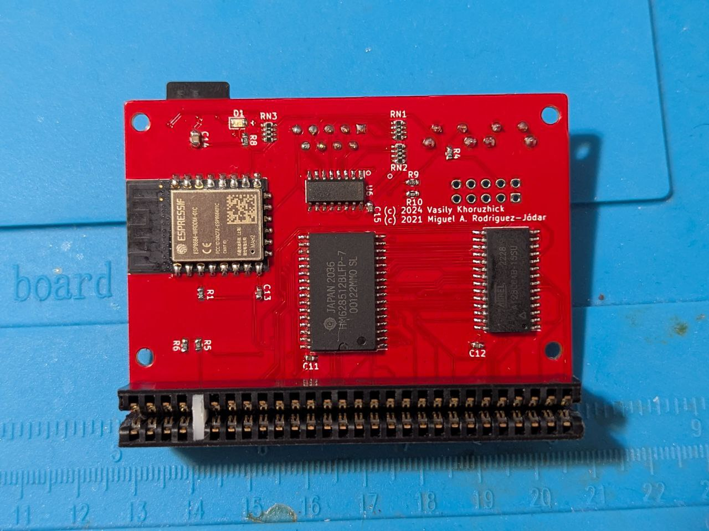
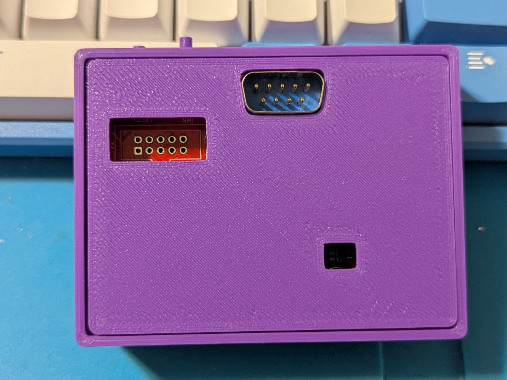
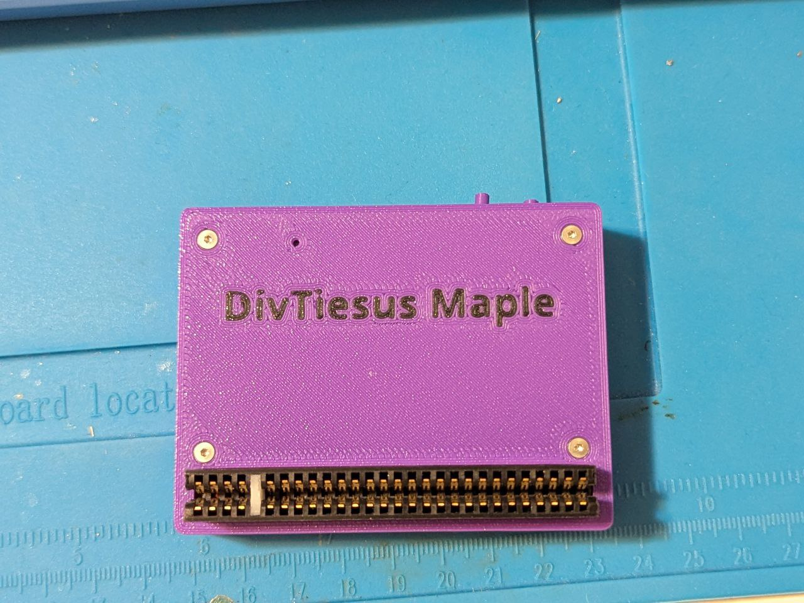
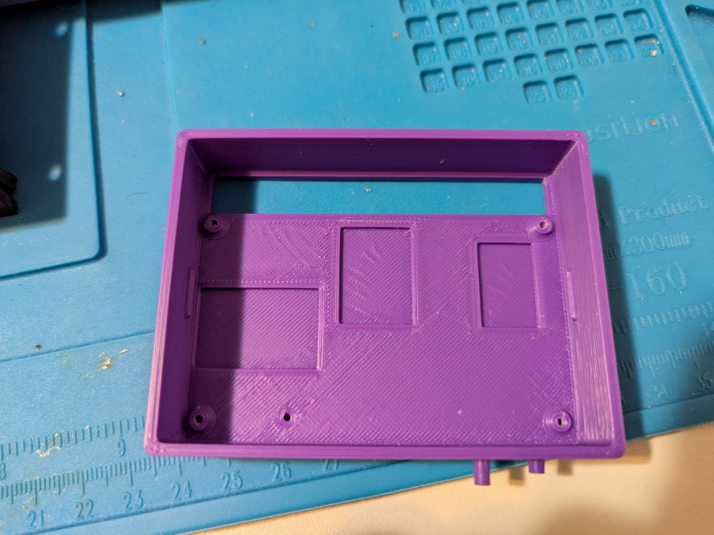
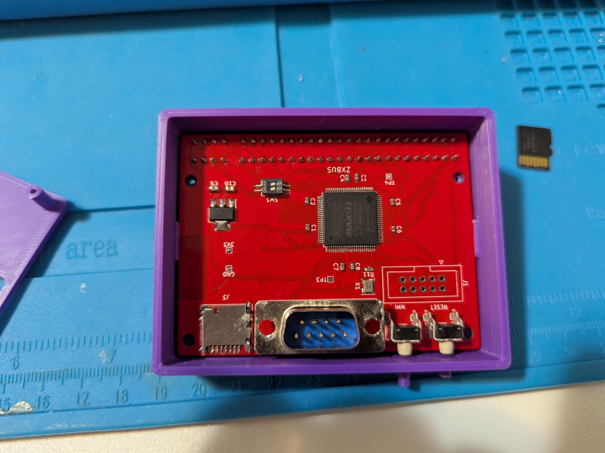
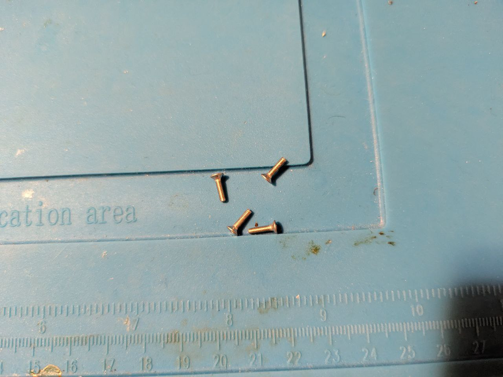

# DivTIESUS Maple Edition
DivTIESUS Maple Edition is a SD/MMC card interface for the ZX Spectrum. It is based on Miguel's [DivTIESUS](https://github.com/mcleod-ideafix/divtiesus), but adds joystick port and serial port for WiFi at the expense of Soft +3E feature. I redid whole project in KiCAD and rerouted the PCB. CPLD pin assignment has been changed to accommodate new PCB layout.

# Features
- DivMMC compatible interface with 8 KiB of EEPROM and 128 KiB or 512 KiB of RAM. Standard utils for EEPROM flashing, as provided by the ESXDOS team, are compatible with DivTIESUS.
- Model autodetection. This means you don't need to put a jumper, or flip a switch to change from using it with a Spectrum 48K and a +3.
- Tested with Harlequin 128 rev. 2D and rev. 4B. I don't have other machines at the moment. Any testing reports will be appreciated
- It uses its own fast clock (24 MHz). It does not need the CPU clock at all.
- NMI button to call file browser in ESXDOS, and handy RESET button.
- MicroSD card slot
- DIP switches for enabling EEPROM flashing and disabling auto-mapping (bottom switch) and for disabling built-in joystick interface (top switch)
- Optional: Zx-Uno-compatible UART (running at 115200 baud) with WiFi. Do not place ESP12 if you are not planning to use it
- Optional: Built-in Kempston joystick interface, compatible with either Atari-style joystick or Sega Genesis joystick (3 or 6-button). Do not place DB9 connector and U6 (74HC165) if you are not planning to use it and disable it with a DIP switch. All 3 buttons are implemented (so called "extended Kempston")
- Joystick interface maps "A" button as "UP" if "Start" button is pressed during machine reset.
- Visual feedback for SD activity (blue led)
- ESXDOS shadowing does not collide with all-RAM feature in +2A/B/3 machines. If the system is in all-RAM mode, ESXDOS ROM mapping is disabled.
- Included STLs for 3D printing an enclosure

# Pictures

# Schematic

Schematics can be found [here](out/schematics.pdf)

# Build
- First, you need the DivTIESUS Maple Edition PCB. You can order it from JLCPCB or from PCBWay using `divtiesus_maple_rev2.zip` file in out  directory.
- Second, source the components. Most of the components are rather standard so you can buy it off DigiKey or Mouser. All of them can also be obtained from AliExpress. Be careful with components from Aliexpress, especially if the price is too good to be true

## Bill of materials

Interactive BOM can be found [here](out/bom/ibom.html)

Links to some components:

|Qty|Component|Link|
|--------|---------|--------|
|1|DIP switches, 2 position|[link](https://www.aliexpress.com/item/33027764033.html)|
|1|RAM|[link](https://www.aliexpress.com/item/1005002495799688.html)|
|1|EEPROM|[link](https://www.aliexpress.com/item/1005003773070206.html)|
|1|ZX Bus connector, 56pin|[link](https://www.aliexpress.com/item/1005002212044956.html)|
|2|Buttons, 6x6x6H|[link](https://www.aliexpress.com/item/1005005129319965.html)|
|1|microSD slot|[link](https://www.aliexpress.com/item/1005006255074403.html)|
|1|Crystal oscillator, 24Mhz|[link](https://www.aliexpress.com/item/1005005879624979.html)|

- The oscillator does not need to be 24 MHz, but if you use a different value, you'll have to resynthesize CPLD image, otherwise WiFi will not work
- I usually start with placing the CPLD first and programming it. Note: you'll need to supply 3.3V in order to program CPLD, there are GND and 3.3V test points left for this purpose. I source CPLDs from Aliexpress and some of them are coming dead. It is easier to test and replace it before the rest of the components are populated.
- Then place the passives (resistors, resistor arrays, capacitors) and the LED
- Then RAM, EEPROM, microSD socket, DB9 connector and ESP12. You can either leave EEPROM blank or preprogram it. Either way is fine, it can be programmed in-system later, but having EEPROM with known contents may simplify troubleshooting

## First electrical testing
- Check that there is no shorts on the 5V and 3.3V power rails.
- Use a microscope or a magnifying glass to check that there is no shorts between adjacent pads at the CPLD chip.

After all the checks, proceed to build and solder the ZX Spectrum bus connector:

## ZX Spectrum bus connector
- Take the 2x28 pin edge connector and cut about 1-2mm on each side to leave the ends opened, refer to original DivTIESUS README.
- Pull and extract the two metal contacts that are positioned at 5th place, where the index tab will be placed
- Now take a small piece you can get from a PCB, 1.5mm thick and 7mm tall. This will be the index tab.
- As an alternative, you can 3D-print the tab, you can find the model [here](https://www.thingiverse.com/thing:6556638)
- Place the tab in the index hole. Sand it if it's too tall for the hole.
- Using a pair of pliers, push it in place. If it's too small for the hole, use some glue to keep it from coming loose.

Now the edge connector is ready to work as a ZX Spectrum rear bus connector!

## Enclosure

Enclosure can be printed in pretty much any plastic. Personally, I printed it in PLA and PETG. ABS should work as well. Keep in mind that PLA will soften at ~60C, so avoid using it for enclosure if you are planning to use the device with an original machine. Modern clones are fine, they are usually using CMOS ICs and modern voltage regulators that do not produce much heat.

First, place the buttons, short button (reset) closer to the edge

Then insert the PCB. Be careful to keep it straight and don't let the buttons to fall out

Use 4 M2x8 screws to fix enclosure top

